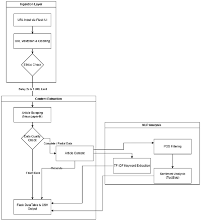
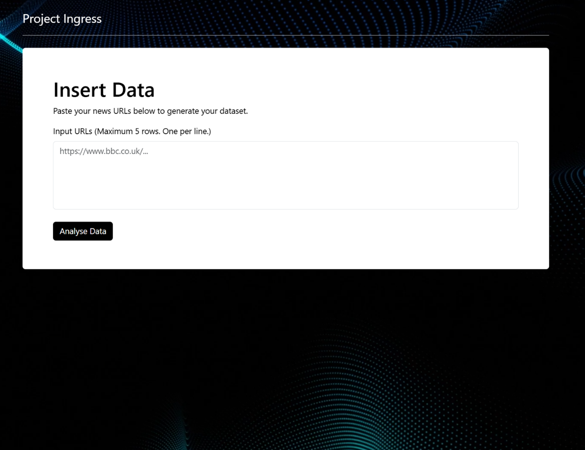
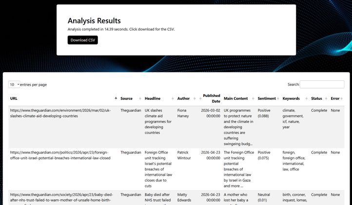

# Project Ingress: Automated News Data Ingestion and NLP Pipeline

Project Ingress is a Python and Flask application that extracts online news articles and transforms unstructured web content into structured CSV datasets for further analysis and machine-learning workflows.

The project was developed as my final-year BSc (Hons) Computing artefact at Abertay University. It was designed to reduce the manual effort involved in collecting, cleaning and preparing news data.

## The Problem

Online news articles contain useful information, but the data is usually unstructured and includes noise that makes it difficult to use immediately in data-analysis or machine-learning workflows.

Project Ingress combines data ingestion, extraction, preprocessing, analysis and CSV generation into a single lightweight pipeline.

## Pipeline Architecture

The application processes each article through three stages:

1. **Ingestion Layer**
   - Accepts article URLs through a Flask interface
   - Removes blank entries and duplicate URLs
   - Limits each submission to five URLs

2. **Extraction Layer**
   - Retrieves article content and metadata
   - Extracts the URL, source, title, author, publication date and main content
   - Assigns a data-quality label to each article

3. **Analysis Layer**
   - Applies part-of-speech filtering before sentiment analysis
   - Generates a polarity score and sentiment label
   - Extracts prominent keywords and phrases using TF-IDF
   - Exports the results as a structured CSV dataset



## Key Features

- Extracts online news articles through a Flask web interface
- Produces structured CSV datasets for further analysis
- Extracts article metadata and main content
- Uses Newspaper4k and tldextract for article and source extraction
- Applies POS-filtered TextBlob sentiment analysis
- Extracts keywords using TF-IDF, unigrams and bigrams
- Uses an extended stopword list to reduce noise in keyword output
- Retains incomplete or failed records rather than silently discarding them
- Limits submissions to five URLs and adds a two-second delay between requests

## Data Quality Classification

Each article receives one of three data-quality labels:

| Label | Meaning |
|---|---|
| **Complete** | The article metadata and content were extracted successfully |
| **Partial** | The article was processed, but one or more fields were missing |
| **Failed** | The article could not be processed and is retained using `N/A` values |

This makes missing information visible and allows users to decide how incomplete rows should be handled during later analysis.

## NLP Techniques

### Sentiment Analysis

TextBlob provides a lightweight lexicon-based sentiment score between `-1.0` and `+1.0`.

Early testing showed that raw journalistic text could produce misleading results because descriptive language sometimes outweighed the underlying meaning of an article. To investigate this issue, a custom preprocessing heuristic was added before sentiment scoring.

The application retains:

- **Verbs** to capture actions
- **Adjectives** to capture descriptive tone
- **Adverbs** to capture intensity and modifiers

The filtered words are passed to TextBlob and classified using the following thresholds:

| Polarity score | Classification |
|---|---|
| Greater than `+0.05` | Positive |
| Between `-0.05` and `+0.05` | Neutral |
| Less than `-0.05` | Negative |

### TF-IDF Keyword Extraction

The application uses scikit-learn's `TfidfVectorizer` to identify prominent keywords and phrases within each article.

| Parameter | Value | Purpose |
|---|---|---|
| `max_features` | `5` | Returns the top five terms |
| `ngram_range` | `(1, 2)` | Captures single words and two-word phrases |
| `sublinear_tf` | `True` | Reduces the impact of repeatedly occurring terms |
| `stop_words` | Extended custom list | Removes common and domain-specific noise |

## Output Schema

Each processed article is exported as one row in a CSV file.

| Column | Description |
|---|---|
| `url` | Original submitted URL |
| `source` | News-source domain |
| `title` | Article headline |
| `author` | Article author |
| `published_date` | Publication date |
| `main_content` | Extracted article body |
| `sentiment` | Positive, neutral or negative label |
| `score` | TextBlob polarity score |
| `keywords` | Extracted TF-IDF keywords |
| `data_quality` | Complete, partial or failed |
| `error` | Missing-field or failure details |

## Evaluation Results

The pipeline was tested using articles from several sources, including BBC News, The Guardian and mixed news websites.

### Pipeline Performance

| Result | Value |
|---|---:|
| Articles tested | 15 |
| Complete rows | 80% |
| Partial rows | 13.3% |
| Failed rows | 6.7% |
| Average processing time per article | 0.96 seconds |

The average processing time excludes the intentional two-second delay between requests.

### Manual vs Automated Processing

A comparison using one article found:

| Method | Processing time |
|---|---:|
| Manual extraction and analysis | 5 minutes 25.27 seconds |
| Automated pipeline | 1.39 seconds |

This demonstrates the potential time-saving benefit of automating repetitive extraction and preprocessing tasks.

### POS-Filtering Experiment

Sentiment labels were compared with manually assigned labels across 30 articles.

| Measure | Raw TextBlob | POS-filtered TextBlob |
|---|---:|---:|
| Overall matching accuracy | 43.3% | 46.7% |
| Negative-article accuracy | 14.3% | 21.4% |

POS filtering produced a measurable improvement, but the results also show the limitations of lexicon-based sentiment analysis when applied to nuanced journalistic text.

## Screenshots

### Article URL Input



### Results Table and CSV Download



## Technologies Used

- Python
- Flask
- Newspaper4k
- tldextract
- BeautifulSoup
- NLTK
- TextBlob
- scikit-learn
- HTML and CSS
- DataTables

## Running the Project

Clone the repository:

```bash
git clone https://github.com/ScottJRyves/Project-Ingress.git
cd Project-Ingress
```

Create a virtual environment:

```bash
python -m venv .venv
```

Activate the environment on Windows:

```bash
.venv\Scripts\activate
```

Install the required packages:

```bash
pip install -r requirements.txt
```

Run the application:

```bash
python app.py
```

Open the local Flask address shown in the terminal.

## Project Poster

A summary poster was created for the Abertay University End of Year Show, covering the project aim, architecture, evaluation results, limitations and future work.

[View the full-resolution project poster](screenshots/project-poster.png)


## Limitations

- Sentiment analysis is based on a lightweight lexicon-based method and does not fully understand context, sarcasm or complex journalistic framing.
- The evaluation used a relatively small sample of articles.
- News websites vary in structure, so some sources may return incomplete metadata or fail to parse.
- The application is currently intended for local, single-user use.

## Future Improvements

- Compare TextBlob results with transformer-based sentiment models
- Test the pipeline against a larger and more diverse set of news sources
- Use multiple human reviewers when evaluating sentiment labels
- Improve the keyword-extraction stage through additional testing
- Add support for larger datasets while maintaining responsible rate limiting

## What I Learned

This project strengthened my understanding of data ingestion, preprocessing, data-quality assessment and Natural Language Processing.

It also demonstrated the importance of evaluating analytical outputs honestly. Automating a process can save significant time, but the resulting dataset still needs clear quality labels, documented limitations and careful interpretation.
